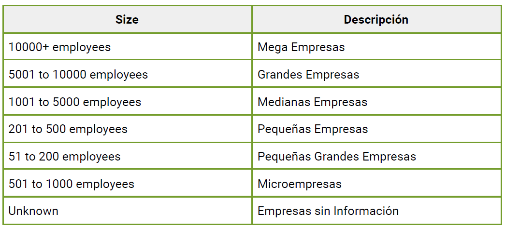

#Desafío - Manipulación y transformación de datos (Parte I)

En este desafío validaremos nuestros conocimientos de uso de DataFrames, manipulando y
transformando datos de ellos. Para lograrlo, necesitarás aplicar lo que has aprendido
durante esa sesión.

Lee todo el documento antes de comenzar el desarrollo individual, para asegurarte de tener
el máximo de puntaje y enfocar bien los esfuerzos.

##Descripción
1. Para desarrollar este desafío necesitarás los siguientes archivos:
● incidents.pkl
● officers.pkl
● subjects.pkl
- a. Carga los datos y crea un DataFrame con cada uno de ellos.
- b. Genera una tabla que contenga la unión de las 3 tablas. hint: utiliza sufijos para para las
columnas que se llaman igual usando el parámetro suffixes de pd.merge().
- c. Verifica si hay filas duplicadas; si es así, elimínalas.
- d. ¿Cuántos sujetos de género F hay en el DataFrame resultante? hint: usa el método
.value_counts() sobre la columna.
- e. ¿En cuántos números de caso hay por lo menos una sospechosa que sea mujer? hint:
utiliza el método unique() para obtener los valores únicos de una columna específica de
un DataFrame luego de filtrar.
- f. Genera una tabla pivote que muestre el número de casos por mes en la fila y por año en
las columnas. hint: genere columnas de tipo fecha con pd.to_datetime(). ¿Se ve alguna
relación entre mes del año y cantidad de casos?
- g. Genera una tabla pivote que muestre en las filas el género del oficial y en las columnas el
género del subject. ¿Cómo interpretas los valores que muestra esta vista?

2. Para continuar con el desarrollo de este desafío, necesitarás el archivos
Cleaned_DS_Jobs.csv
- a. Carga los datos y crea un DataFrame con ellos.
- b. Utiliza la siguiente lista de valores que serán considerados como nulos:
["na", "NA", -1, "0", "-1", "null", "n/a", "N/A", "NULL"]
(hint: utiliza el método replace para reemplazar los valores indicados por np.nan)
- c. Elimina todas las filas con datos faltantes. (hint: utiliza el método .dropna())
- d. A partir de la columna “Salary Estimate”, genera dos columnas: Salario Estimado Mínimo
y Máximo. (hint: Utiliza el método apply sobre la columna.)
- e. Realiza la recodificación de la columna Size con los valores de la siguiente tabla: (hint:
utilice reemplazo con diccionario usando el método replace sobre la columna.)

- f. Finalmente, genera una tabla pivote que muestre la media del salario estimado mínimo y
la media del salario estimado máximo por tamaño de empresa. (hint: utiliza
pd.pivot_table para generar la vista adecuada con las columnas generadas.)

